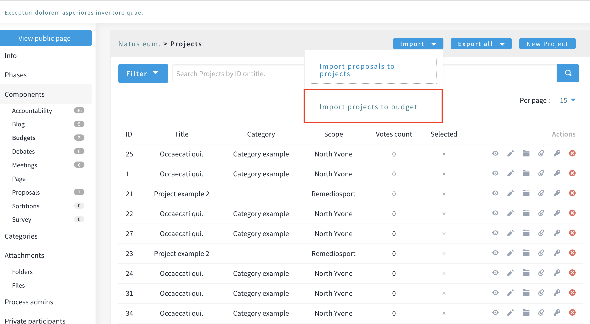
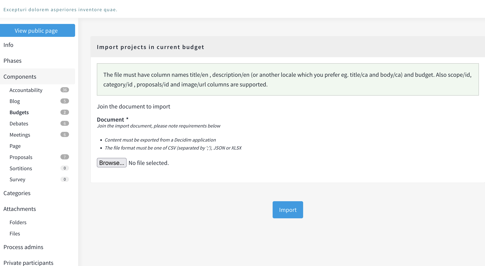
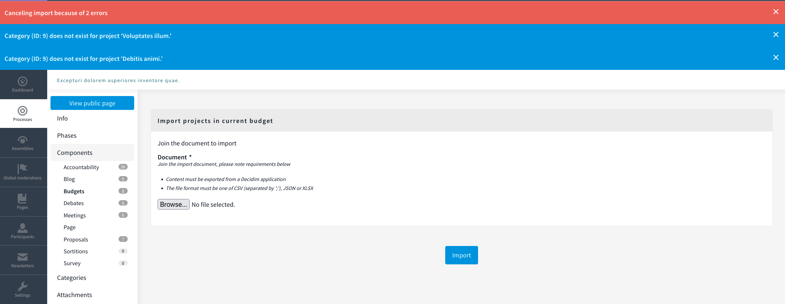

# Decidim::BudgetsImporter

Decidim budgets importer allows to import Decidim budgets directly from the backoffice.

## Usage

Go to the backoffice as administrator, and import budgets.

## Installation

Add this line to your application's Gemfile:

```ruby
gem "decidim-budgets_importer"
```

And then execute:

```bash
bundle
```

## Screenshots

Index budget projects view:



Import projects in budget:



Errors on projects import:



## Contributing

Contributions are welcome !

We expect the contributions to follow the [Decidim's contribution guide](https://github.com/decidim/decidim/blob/develop/CONTRIBUTING.adoc).

## Security

Security is very important to us. If you have any issue regarding security, please disclose the information responsibly by sending an email to __security [at] opensourcepolitics [dot] eu__ and not by creating a Github issue.

## License

This engine is distributed under the GNU AFFERO GENERAL PUBLIC LICENSE.
